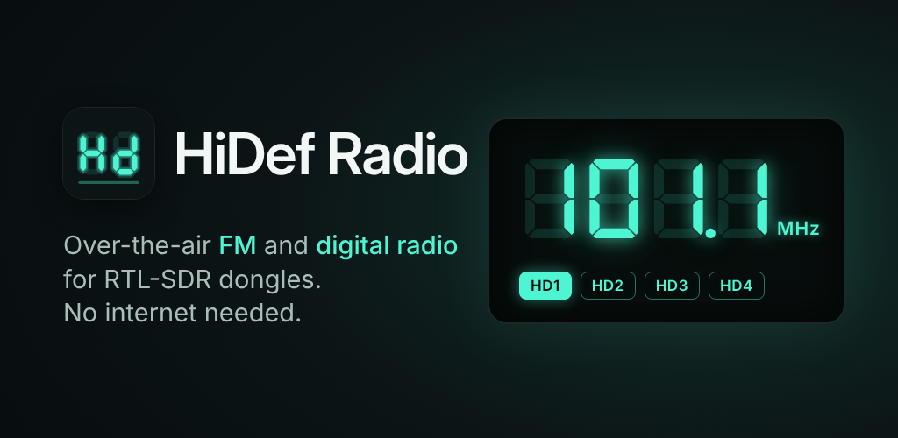
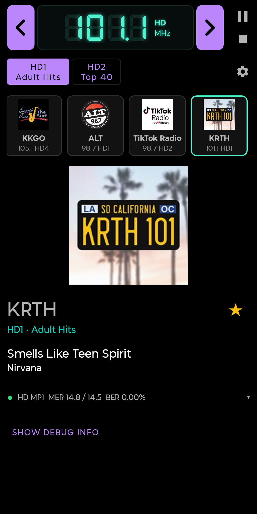
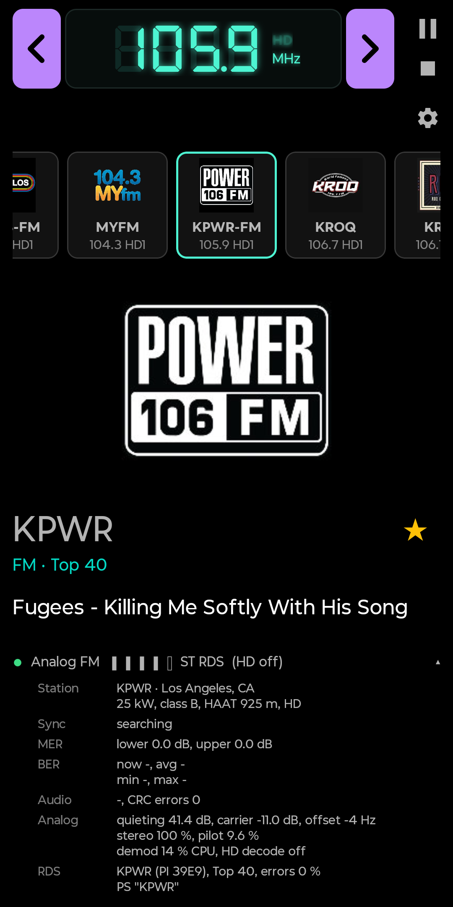
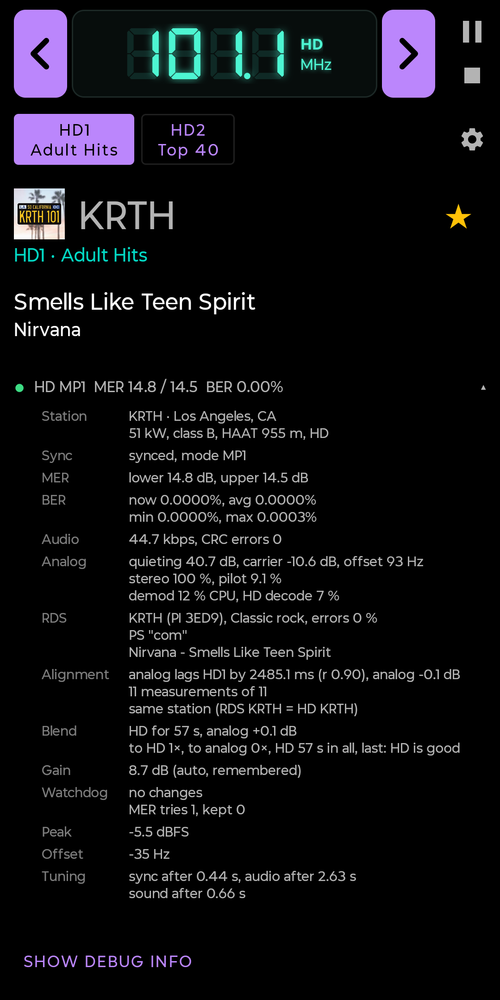

# HiDef Radio



An Android radio for the **RTL-SDR dongle**. Plug the dongle into the phone with a USB-OTG adapter and listen to **HD Radio™ (NRSC-5)** and ordinary **analog FM**, with a smooth blend between the two, like a car radio.

No root, no computer, no `rtl_tcp`, no internet. Everything you hear and see comes from the antenna: audio, station names, song titles, station logos and album art. The app has no internet permission at all.

> **Status: 1.0 beta.** A closed test on Google Play is starting (see [Help test it](#help-test-it)). Developed on a Moto G Stylus 2024 (Android 15) with an RTL-SDR Blog V4 in Los Angeles, and also run on a Pixel 8.

<p>
  
  
  
</p>

## Features

### What it receives

- **HD Radio on FM**: HD1 and the extra programs (HD2, HD3, HD4 ... up to eight). A button appears for each program the station actually carries.
- **Analog FM in stereo**, with a stereo-to-mono blend as the signal gets noisy.
- **RDS / RBDS** on analog FM: call letters, program type, RadioText, and song title and artist where the station sends them.
- **HD Radio on AM** (digital only for now, and new - see [Known limits](#known-limits)). It needs a dongle that can tune AM, such as the RTL-SDR Blog V4.
- Band plans for the Americas, Europe and most of the world, Japan and Brazil, each with the right FM de-emphasis (75 or 50 µs).

### The blend

- In the default **Auto** mode the analog sound starts within a moment of tuning. About ten seconds later the app has measured how far apart the analog and the HD audio are, and how much louder one is than the other, and it crossfades to HD without a skip or a jump in volume.
- The HD audio is decoded about 2.5 seconds before it is due, so a dropout is known in advance. The blend fades back to analog before the gap and returns once the HD is clean again.
- HD2 and up have no analog twin and play live.
- You can also choose **Digital only** or **Analog only**. Analog only switches the HD decoder off, which saves battery.

[How the blend works](#how-the-blend-works) has the details.

### For listening

- A "now playing" screen with a glowing VFD-style frequency display, station name, program, title and artist, album art and station logos.
- **Favorites** as a scrolling strip of logo tiles. Tap ☆ to save the current station and program, hold a tile and drag it to change the order, and long-press to rename or delete. Logos are cached, so the tiles show them before a station sends them again.
- Plays in the background with the screen off.
- Media controls in the notification, on the lock screen, and from headsets, Bluetooth and car radios. ⏮ ⏭ jump between favorites. Pause keeps the tuner running, so playback resumes live right away. The radio stops by itself after a pause (5 minutes by default) and pauses when you unplug headphones.
- You choose what happens when another app plays sound: mute and resume, stop, or play along.
- Light, dark gray and true black themes.

### For radio people

- **Signal details**: sync and service mode, MER per sideband, BER, bit rate, the analog quieting, carrier level and frequency offset, pilot level and stereo amount, the RDS code, the measured analog/HD alignment, what the blend did, tuner gain, peak level (with an overload warning) and the time to sync and to first sound.
- A **5-bar signal meter** for analog FM that is based on quieting (how far the noise sits below full modulation), not on the carrier level. The carrier level of an RTL-SDR depends on the gain the strongest station in the band sets, so it says little about the station you are tuned to.
- **Tuner gain**, automatic or manual, applied live. Automatic measures the signal when you tune, then a watchdog keeps adjusting while you listen. It steps down at once on overload and steps up when the signal is weak. The gain that worked is remembered for each station.
- **FM stereo**: Auto (mono when noisy), Always mono (cuts the hiss of weak DX stations) or Always stereo.
- A **built-in station list** from FCC data (the US, plus the Canadian and Mexican stations the FCC keeps on file). The details show the city of license, power and class, and stations whose RDS code can't be turned into call letters on its own (iHeart's "1xxx" codes) still get their call sign. Nothing is looked up online.
- A notice when the HD signal on a frequency belongs to **another station** than the analog one you hear (it happens to DXers), with a tap to listen to the other one.

### Private by design

No internet permission, no ads, no account, no tracking. See the [privacy policy](https://github.com/derek20la/hidefradio-privacy).

## What you need

- An Android phone with **USB host (OTG)** support, 64-bit ARM (arm64-v8a), Android 8.0 or newer.
- An **RTL-SDR dongle**. Developed with the RTL-SDR Blog V4 (R828D tuner). The RTL-SDR Blog V3 and other R820T / R828D dongles use the same driver and should work on FM.
- A USB-OTG adapter or cable, and an antenna.
- For HD Radio: a station that broadcasts it. HD Radio is on the air in the United States, Canada and Mexico. Elsewhere the app is an analog FM radio with RDS.
- For AM: a dongle that can tune below 24 MHz. That is the RTL-SDR Blog V4, which has an upconverter built in, or a dongle with a direct-sampling input such as the V3 (expected to work, not confirmed yet).

The dongle is powered by the phone, and on a phone with one USB port you can't charge while it is plugged in. In one test the radio used about 9 % of the battery per hour.

## Help test it

Google asks new developers to run a closed test with at least 12 testers before an app can be published, so testers are very welcome, above all people who own a dongle.

1. Join the testers' group: <https://groups.google.com/g/hidef-radio-testers>
2. Become a tester: <https://play.google.com/apps/testing/io.github.derek20la.hidefradio>
3. Install HiDef Radio from the Play Store link on that page.

If step 2 says the app isn't available, the test release is still waiting for Google's review. Try again a few days later.

Please tell me which phone and dongle you use and what works or doesn't: open an issue here, or write to hidefradioapp@yahoo.com.

## Building

1. Install **Android Studio** with these SDK components:
   - NDK **30.0.16248370**
   - CMake **3.22.1**
   - Android SDK platform **37**
2. Clone this repository and open the folder in Android Studio.
3. **Build → Assemble Project**, then run it on your phone. Wireless debugging works well, since the phone's USB port is taken by the dongle.

All native libraries are built from source by Android Studio's CMake. Their sources are in `app/src/main/cpp/external`, so nothing needs to be downloaded or installed separately.

Good to know:

- The debug build installs as a separate app, **HiDef Radio dev** (`io.github.derek20la.hidefradio.debug`), so it can sit next to a release install.
- A release build is signed only if you put a `keystore.properties` file with your own key in the project's root folder. The four lines it needs are described at the top of `app/build.gradle.kts`. That file and the key are git-ignored. Without it everything still builds, and the release build is just not signed.
- The native code is built for 64-bit ARM only (`abiFilters` in `app/build.gradle.kts`).

## How it works

```
RTL-SDR dongle --USB--> libusb + librtlsdr (opened with Android's USB permission)
                           |
                           |  raw IQ samples, 1,488,375 samples/s
                           |
              +------------+-------------+
              |                          |
              v                          v
      nrsc5 (pipe mode)            fmdemod.hpp
      HD audio, station name,      analog FM in stereo, signal meter
      song info, logos, art        rds.hpp: RDS / RBDS
              |                          |
              |   aligner.hpp compares the two: time offset and loudness
              |                          |
              +------------+-------------+
                           |
                           v
                       blend.hpp   delay line, look-ahead, crossfade
                           |
                           v
          native ring buffer --JNI--> Kotlin AudioPlayer --> AudioTrack
                                      RadioService (foreground) + MainActivity
```

One stream of samples from the dongle feeds both decoders, so the analog and the HD audio share one clock and can't drift apart.

### How the blend works

1. **Analog first.** The FM demodulator has sound within a second of tuning. The HD decoder needs a few seconds to sync and to produce its first audio.
2. **Measure the delay.** A station delays its analog audio so that a receiver's HD decoder has time to catch up (the "diversity delay"). nrsc5 decodes faster than that, so in this app the HD audio comes out about 2.5 seconds before the same sound arrives on the analog side. The figure is close to 2.485 s on most Los Angeles stations, but a few are tens of milliseconds off and one wanders from day to day, so `aligner.hpp` measures it on every tune by cross-correlating the two audio streams. A match is accepted only when the correlation is at least 0.5.
3. **Match the loudness.** The aligner also measures how much louder one side is, and the blend brings the analog to the HD's level. The station's own "digital audio gain" field (which nrsc5 reports but does not apply) is applied to the HD audio first.
4. **Crossfade.** Once a match is confirmed and the next two seconds of HD are clean, `blend.hpp` crossfades over half a second. The two streams are lined up to within one audio sample, so there is no echo and no skip.
5. **Look ahead.** Because the HD audio is 2.5 seconds early, a dropout or sync loss is seen before it would be heard. The blend fades to analog ahead of the gap and comes back when the HD is clean again. If the HD keeps dropping, it waits a little longer each time before going back.
6. **When the audio never lines up.** Then the HD signal on that frequency may belong to another station than the analog one, which happens with distant stations. A setting decides whether to play that HD anyway or stay on the analog. One exception: if the call letters from RDS and from the HD signal are the same, it is the same station with its two sides processed very differently, and the HD is played.

FM stereo has a blend of its own: full stereo above 36 dB of quieting, mono below 24 dB and a gradual change in between, modelled on what car-radio tuner chips do. One finding from this project: on the RTL-SDR the noise after the FM discriminator measured almost flat from 16 to 100 kHz, where textbooks show it rising with frequency. Stereo therefore costs only about 5 dB of extra hiss, where the classic figure is around 20 dB.

### Where things are

- `app/src/main/cpp/native-lib.cpp` is the C++ side. It opens the dongle, streams samples into nrsc5 and the FM demodulator, handles nrsc5's events and keeps the audio ring buffers.
- Next to it are four self-contained C++17 headers with no Android code in them:
  - `fmdemod.hpp`: the analog FM demodulator (stereo decoder, pilot PLL, quieting meter).
  - `rds.hpp`: the RDS / RBDS decoder. It needs nothing but the FM multiplex signal.
  - `aligner.hpp`: measures the analog-vs-HD time offset and loudness difference.
  - `blend.hpp`: the delay line, the look-ahead and the crossfade.

  Feel free to lift them for your own nrsc5 project.
- `app/src/main/java/io/github/derek20la/hidefradio/` is the Kotlin side:
  - `RadioEngine`: the JNI functions.
  - `RadioService`: the foreground service, tuning, audio focus and the media notification.
  - `MainActivity`: the screen.
  - `AudioPlayer`, `GainKeeper` (the gain watchdog), `Stations` (the station list), `Presets` (the favorites), `LogoCache`, `Settings` and the rest.
- `app/src/main/assets/stations/` holds the station list. `tools/fcc/make_stations.py` builds it from the FCC's data.
- `app/src/main/cpp/CMakeLists.txt` builds libusb, librtlsdr, FFTW, FAAD2 and nrsc5 as static libraries.
- `tools/harness` runs the whole native engine on a PC against an IQ recording (`.cu8`), with no phone and no dongle. Every DSP step was tested that way.
- `tools/lrcheck` is the test that proves the FM stereo decoder has left and right the right way round.
- `store/` holds the pictures for the Google Play listing.

## Known limits

- After every tune you hear about ten seconds of analog before the HD takes over. Measuring the alignment takes that long.
- In Auto, HD1 plays about 2.5 seconds behind Digital only. That delay is what makes the look-ahead possible.
- AM is HD only. Analog AM, with the blend, is planned for version 1.1.
- AM HD has had little on-air testing. The decoding was verified by running off-air recordings of an AM HD station through the app's engine (`tools/harness`), but no AM HD station reaches the place where the app is developed.
- 64-bit ARM phones only.
- So far it has been tested in the Los Angeles area only, on two phones. Reports from other phones, dongles and places are what the closed test is for.

## Plans

- **1.1**: analog AM with the blend, and C-QUAM AM stereo.
- **Later**: a DX log, seek and scan, a time-shift pause.

## Credits and licenses

HiDef Radio stands on the shoulders of these projects:

| Component | What it does | License |
|---|---|---|
| [nrsc5](https://github.com/theori-io/nrsc5) v3.2.0 | HD Radio decoder | GPL-3.0-or-later |
| [librtlsdr, RTL-SDR Blog fork](https://github.com/rtlsdrblog/rtl-sdr-blog) | Dongle driver (V4 support) | GPL-2.0-or-later |
| [libusb](https://libusb.info) 1.0.30 | USB access | LGPL-2.1-or-later |
| [FFTW](https://www.fftw.org) 3.3.10 | Fast Fourier transforms | GPL-2.0-or-later |
| [FAAD2](https://github.com/knik0/faad2) 2.11.2 + nrsc5's HDC patch | AAC audio decoder | GPL-2.0-or-later |
| [DSEG](https://www.keshikan.net/fonts-e.html) font (DSEG7 Classic) | VFD frequency display | SIL OFL 1.1 |
| Material icons (settings, play, pause, skip, stop) | ⚙ and media buttons | Apache-2.0 |
| AndroidX, Material Components, Kotlin | Android libraries | Apache-2.0 |

- **Code from FAAD2 is copyright (c) Nero AG, www.nero.com.**
- **Changes to bundled code:**
  - librtlsdr: added `rtlsdr_open_fd()`, so the dongle can be opened with the file descriptor Android gives the app. These changes are marked "HiDef Radio patch".
  - FAAD2: nrsc5's `faad2-hdc-support.patch` is applied.
  - nrsc5 is unmodified. One thing to know if you use it yourself: its HD audio comes out with left and right swapped and the polarity inverted, compared with the same station's analog audio decoded per the FM stereo standard (measured on 20 Los Angeles stations). HiDef Radio corrects that where the audio arrives (`fixHdAudio()` in `native-lib.cpp`); see `tools/lrcheck/README.md`.
- **Station list** (`app/src/main/assets/stations/`): made from the FCC's FM Query and AM Query (US government data, public domain) by `tools/fcc/make_stations.py`. To refresh it, follow the steps at the top of that script.
- **Thanks** to [redsea](https://github.com/windytan/redsea) (MIT), used to cross-check the RDS call-letter and character tables. No code was taken.
- **Thanks** to [ngsoftfm](https://github.com/f4exb/ngsoftfm) (GPL, the SoftFM family) and [Gqrx](https://github.com/gqrx-sdr/gqrx), the reference FM stereo decoders in the left/right check. Test tools only - nothing of them is in the app.
- **Ideas borrowed** (with thanks) from [nrsc5-dui](https://github.com/markjfine/nrsc5-dui) and the [SDRSharp NRSC5 plugin](https://github.com/tuxcator/SDRSharp-NRSC5-Plugin), both GPL-3.0:
  - the logo cache
  - telling logos from album art
  - signal details
  - the sync-loss grace period
  - fades on program switch

Each library's own license file is in its folder under `app/src/main/cpp/external`. Inside the app, **Settings → About → Open-source licenses** shows the credits and the full license texts.

## Trademarks

"HD Radio" is a trademark of iBiquity Digital Corporation, an Xperi company. HiDef Radio is an independent hobby project. It is not affiliated with or endorsed by Xperi or iBiquity.

The station logos and album art in the screenshots were received over the air and belong to their owners.

## License

Copyright (C) 2026 Derek ([github.com/derek20la](https://github.com/derek20la))

This program is free software: you can redistribute it and/or modify it under the terms of the GNU General Public License as published by the Free Software Foundation, either version 3 of the License, or (at your option) any later version.

This program is distributed in the hope that it will be useful, but WITHOUT ANY WARRANTY; without even the implied warranty of MERCHANTABILITY or FITNESS FOR A PARTICULAR PURPOSE. See the [LICENSE](LICENSE) file for details.
